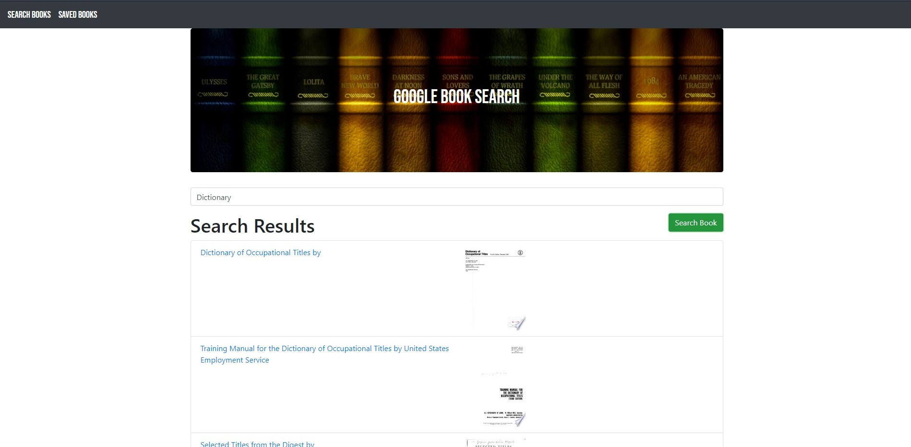

# Budget Tracker [](https://opensource.org/licenses/MIT)

## Table of Contents
  * [Description](#Description)
  * [User Story](#User-Story)
  * [Contributors](#Contributors)
  * [Language/Technoligies Used](#Language/Technologies-Used)
  * [Mock-Up](#Mock-Up)    
  * [Repository](#Repository-Link)
  * [Questions](#Questions)


## Description 
The Google Book Search application allows the user to search for books and see a list of books with a title, poster, and description displayed. The user can also save books and view them all on the saved books page.

## User Story
```
AS AN avid book reader

I WANT to be able to search for a book of my choice and save it

SO THAT I can have all my saved books in one page
```
## Contributors
 [Janneth Alvarado Verduzco](https://github.com/jannverduzco) - janneth_verduzco@live.com


## Language/Technologies Used
* HTML
* CSS
* JavaScript
* JSX
* React
* NPM package(Package.json)
   * React 
   * Express
   * mongoose
   * Path
   * react-router-dom
   * Router
   * bootstrap
* Heroku (Deployment)
* ESLint (Testing code)

## Mock-Up 

### App Dashboard


## Live Link (Heroku)
### https://google-book-search-mrn.herokuapp.com/

## Repository Link
### https://github.com/jannverduzco/Google-Books-Search

 ## Questions
 Please contact me direclty at [janneth_verduzco@live.com](janneth_verduzco@live.com) with any questions or suggestions.